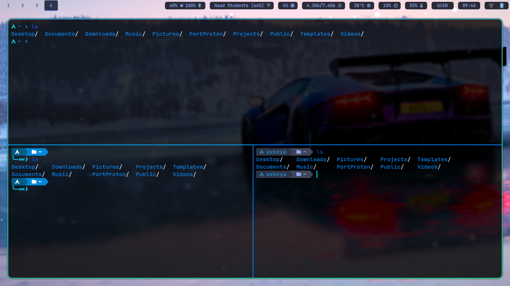
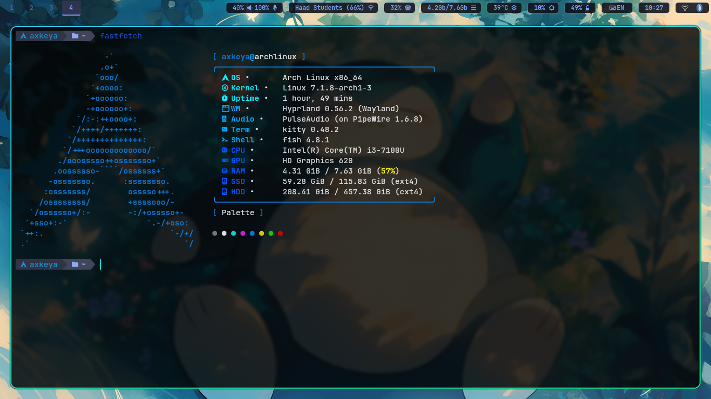

# 🛠️ Axkeya's Dotfiles

Personal configuration files for an **Arch Linux** environment powered by the **Hyprland** Wayland compositor.

## 🎨 UI Components & Previews

### 📊 Status Bar (Waybar)

Includes multiple layouts togglable on the fly via `toggle-style.sh`.

| Minimal Style |
| :--- |
|  |

| Detailed Style |
| :--- |
|  |

---

### 🚀 App Launcher & Menus (Rofi)

Custom Rofi setup featuring custom themes and utility scripts for power control, wallpaper management, and device switching.

| Application Launcher | Power Menu | Wallpaper Menu |
| :---: | :---: | :---: |
|  |  |  |

---

### 💻 Terminal & Shell (Kitty + Fish)

Customized **Kitty** terminal coupled with a feature-rich **Fish shell** environment

| Kitty Terminal |
| :--- |
|  |

<details>
<summary>💡 Custom Prompt Switcher</summary>

Includes a custom Fish function `switch_prompt.fish` that allows you to change shell prompt layouts on the fly.

**Usage:**
```fish
switch_prompt <1-3>
```
</details>

---

### 📊 System Information (Fastfetch)

Custom **Fastfetch** configuration displaying system hardware specs, shell environment, and color palette.

| Fastfetch Overview |
| :--- |
|  |
