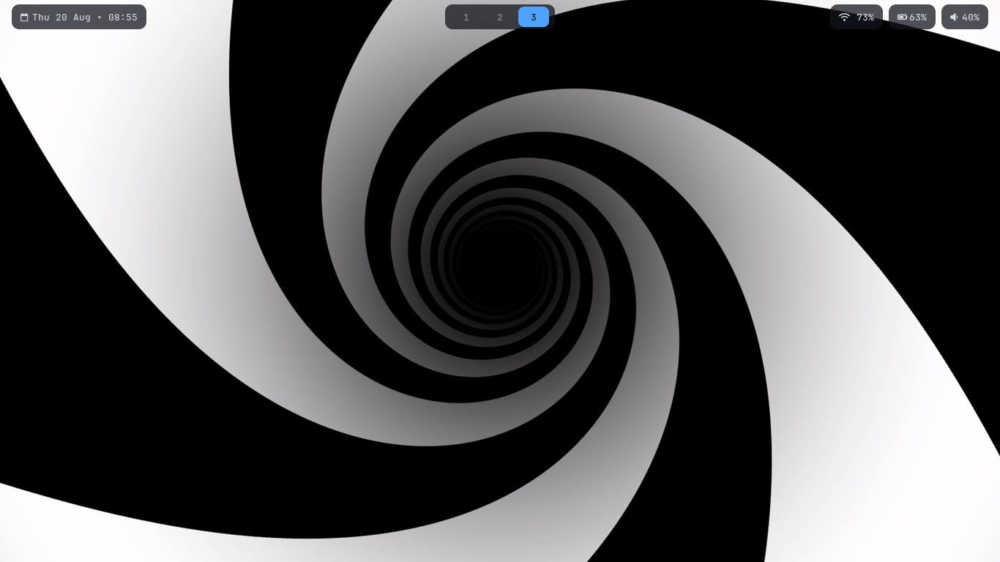
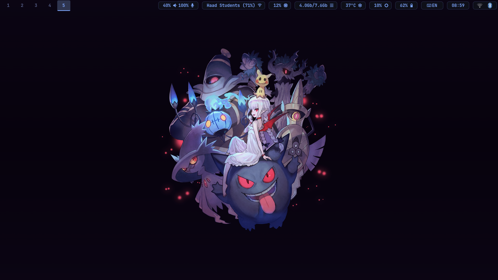
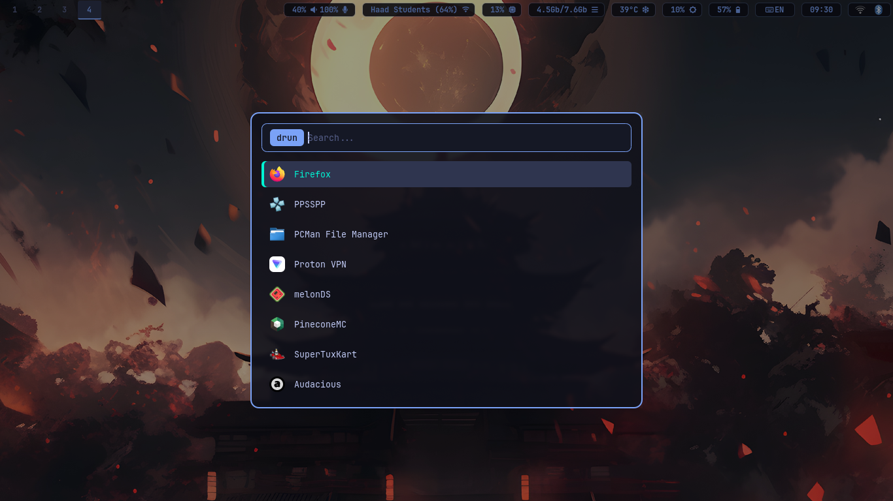
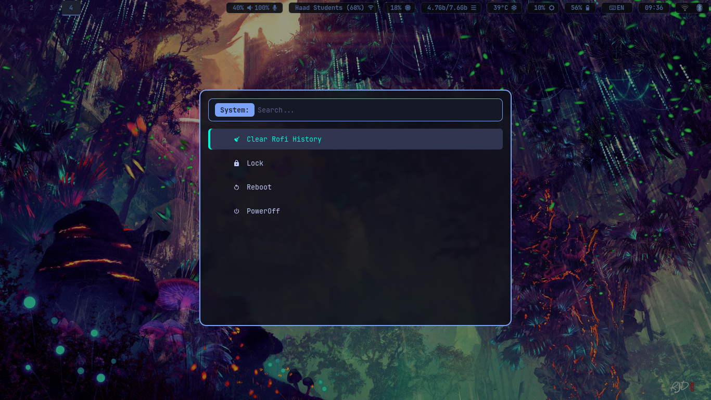
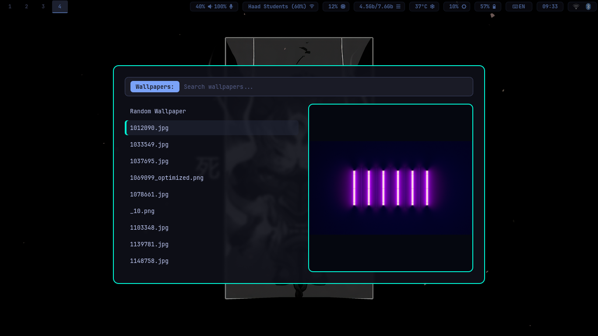

# 🛠️ Axkeya's Dotfiles

Personal configuration files for an **Arch Linux** environment powered by the **Hyprland** Wayland compositor.

## 🎨 UI Components & Previews

### 📊 Status Bar (Waybar)

Includes multiple layouts togglable on the fly via `toggle-style.sh`.

| Minimal Style |
| :--- |
|  |

| Detailed Style |
| :--- |
|  |

---

### 🚀 App Launcher & Menus (Rofi)

Custom Rofi setup featuring custom themes and utility scripts for power control, wallpaper management, and device switching.

| Application Launcher | Power Menu | Wallpaper Menu |
| :---: | :---: | :---: |
|  |  |  |

---

### 💻 Terminal & Shell (Kitty + Fish)
